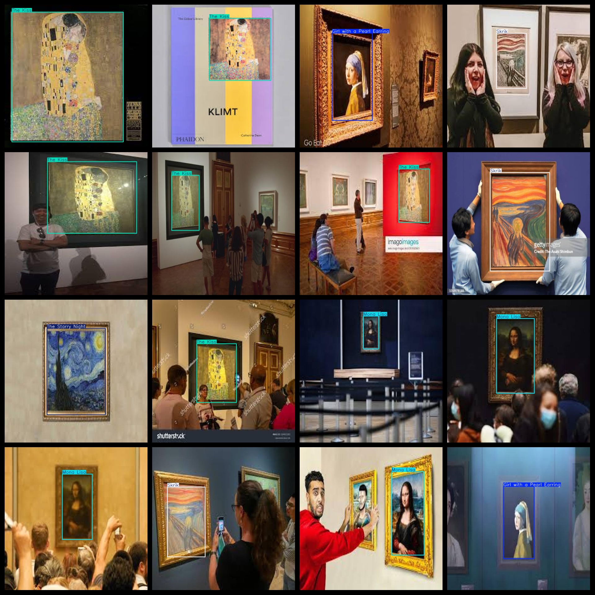

# Famous Painting Detection Dataset 412 imagesVOC+YOLO format

Masterpiece detection dataset 412 sheets in VOC + YOLO format

Dataset format: Pascal VOC format + YOLO format (the txt file does not contain the split path, it only contains jpg images and corresponding VOC format xml files and yolo format txt files)

Number of images (Total number of jpg files): 412

Number of xml files: 412

Number of txt files: 412

Number of callout categories: 5

The Github repository is: datasets_sl

["Girl with a Pearl Earring", "Mona Lisa", "Skrik", "The Kiss", "The Starry Night"]

The Girl with Pearl Earrings, Mona Lisa, Skrik, Kiss, Starry Night

Number of boxes labeled in each category:

"Girl with a Pearl Earring" is a painting by Vincent Van Gogh. It has 61 frames in total, which are the number of times it was exhibited in different museums and galleries around the world. The painting itself is considered one of Van Gogh's most iconic works and is widely recognized for its vivid colors, dynamic brushwork, and emotional expression.

Mona Lisa Frame Count = 189

Skrik frame count = 35

The Kiss Frame Count = 86

The Starry Night is framed at 48.

Total frame count: 419

Number of images per category:

Girl with a Pearl Earring has 61 pictures.

Number of Mona Lisa pictures = 184

Skrik's possession count = 34

Kiss Claims Picture Count = 85

The number of pictures in "Starry Night" = 48

Image resolution: 640x640

Use the labeling tool: labelImg

Dataset Augmentation: No

Rules for annotation: Draw a rectangle around the category.

Important note: The dataset does not have been divided into training, validation, and testing sets.

Special Disclaimer: This dataset does not guarantee the accuracy of the trained models or weight files.

Annotation and image details are as follows:

## Images

---

Here is a pay link on Stripe (https://buy.stripe.com/3cs8yP7sY87d0vu9AB). Please contact me lonlonago@foxmail.com after funding $89, and I will send you a complete data files, thank you!

